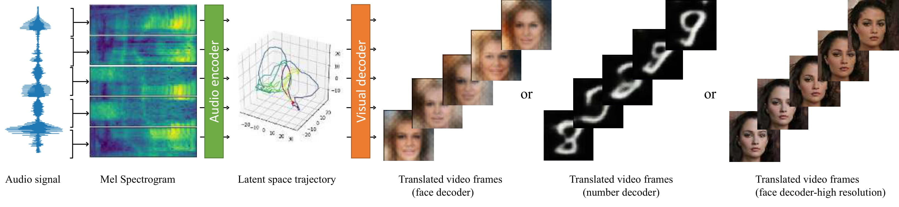

# AudioViewer: Learning to Visualize Sounds (WACV 2023)
 


> **AudioViewer: Learning to Visualize Sounds** <br>
> [Chunjin Song*](https://chunjinsong.github.io/), Yuchi Zhang*, Willis Peng, Parmis Mohaghegh, [Bastian Wandt](https://bastianwandt.de/), and [Helge Rhodin](https://www.cs.ubc.ca/~rhodin/web/) <br>

[[Paper](https://arxiv.org/pdf/2012.13341.pdf)][[Website](https://chunjinsong.github.io/audioviewer/)]

## Setup

### Requirements

- Librosa >= 0.8
- Python >= 3.7
- PyTorch >= 1.5
- CUDA enabled computing device

### Dependencies

Install all the Python dependencies using pip:

~~~
pip install -r requirements.txt
~~~

Alternatively, you can install them with Anaconda:

~~~
conda install -n <env_name> requirements.txt
~~~
## Dataset
Audio Dataset can be found from [google drive](https://drive.google.com/drive/folders/1P4FtTj_b04YvJN5ScV_0qF409EiUrhq1?usp=sharing)
The visual dataset can be accessed by following the instructions provided in 'style_soft_intro_vae'.

## Pre-trained models
Pre-trained models can be found from [google drive](https://drive.google.com/drive/folders/1U5_52z2Ip67X72Vb1meOxTtMGLB4UQg0?usp=sharing)

## Training

To train the models, please follow these steps:

First, train the audio model using 'training_audio.py'.

Next, train the visual model using 'style_soft_intro_vae'.

Finally, train the A2V (Audio-to-Visual) mapping module by following the corresponding notebooks provided in 'training.py'.

## Evaluate

To evaluate the trained models, please refer to `testing.py`

## Citation

```
@article{audioviewer,
          title={AudioViewer: learning to visualize sound},
          author={Chunjin, Song and Zhang, Yuchi and Peng, Willis and Wandt, Bastian and Rhodin, Helge},
          journal={WACV},
          year={2023}
        }
```
